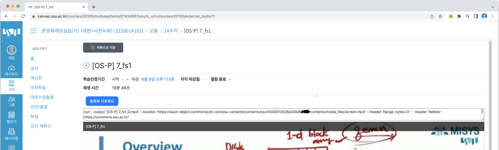
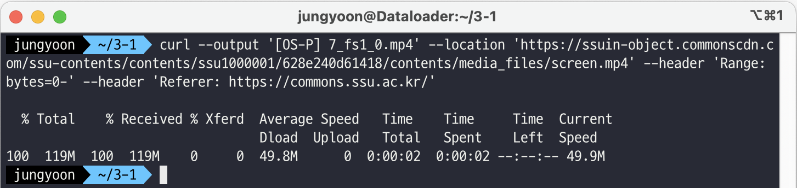

# LMS Downloader

LMS 동영상 강의 페이지에서 mp4 주소를 파싱하여 curl 명령어로 만들어주는 프로그램입니다.

## Example
프로그램으로 사용해서 얻을 수 있는 결과입니다.




```
curl --output '[OS-P] 7_fs1_0.mp4' --location 'https://ssuin-object.commonscdn.com/ssu-contents/contents/ssu1000001/628e240000000/contents/media_files/screen.mp4' --header 'Range: bytes=0-' --header 'Referer: https://commons.ssu.ac.kr/'
```

## Using
1. 동영상강의 페이지에서 새로 생긴 동영상 다운로드 버튼 클릭
2. textarea에 생긴 링크들 복사
3. 터미널에 붙여넣기

## Modify
귀찮다면 bundle.js만 고치세요.

### Install
```
npm init -y
npm install xml2js browserify --save
```

### Build
```
npx browserify background.js -o bundle.js
```